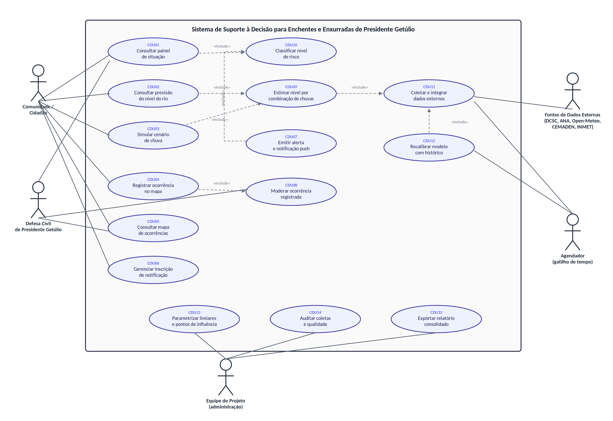

# Especificação Completa do Sistema

Sistema de Suporte à Decisão para Enchentes e Enxurradas de Presidente Getúlio (SC)

| Campo | Conteúdo |
|---|---|
| Disciplina | 75PIN, Projeto Integrador II, UDESC/CEAVI, 2026/2 |
| Professor | Dr. Pedro Sidnei Zanchett |
| Equipe | Diogo e Felipe |
| Entrega | Itens 15 e 16 do cronograma (24 e 26/09), especificação completa e validação de escopo |
| Base arquitetural | RADIAN (ZANCHETT, 2025), ver [estudo da arquitetura](radian.md) |
| Versão | 2.0, revisada após validação de campo com a Defesa Civil municipal |
| Documentos de apoio | [Fontes de dados validadas](fontes-de-dados.md), [Arquitetura de desenvolvimento](arquitetura-desenvolvimento.md) |

## Sumário

1. [Visão geral](#1-visão-geral)
2. [Contexto e delimitação do problema](#2-contexto-e-delimitação-do-problema)
3. [O que já existe e onde está a lacuna](#3-o-que-já-existe-e-onde-está-a-lacuna)
4. [Derivação da arquitetura RADIAN](#4-derivação-da-arquitetura-radian)
5. [Atores](#5-atores)
6. [Requisitos funcionais](#6-requisitos-funcionais)
7. [Requisitos não funcionais](#7-requisitos-não-funcionais)
8. [Regras de negócio](#8-regras-de-negócio)
9. [Modelo analítico](#9-modelo-analítico)
10. [Casos de uso](#10-casos-de-uso)
11. [Modelo de dados conceitual](#11-modelo-de-dados-conceitual)
12. [Restrições e premissas](#12-restrições-e-premissas)
13. [Riscos](#13-riscos)
14. [Critérios de aceitação](#14-critérios-de-aceitação)
15. [Pendências para validação](#15-pendências-para-validação)
16. [Referências](#16-referências)

---

## 1. Visão geral

### 1.1 O problema

Presidente Getúlio alaga por um mecanismo que não é o mesmo das cheias lentas do Itajaí-Açu em Rio do Sul. A área urbana fica sobre o rio dos Índios e o ribeirão Revólver, dois cursos pequenos e de resposta rápida, que deságuam no rio Itajaí do Norte (Hercílio). O município já sofreu com isso de forma grave: em dezembro de 2020 uma enxurrada matou 9 pessoas na cidade, depois de aproximadamente 120 mm de chuva em 6 horas, e em 2023 foram 8 eventos de enchente ou enxurrada ao longo do ano, com decretação de emergência.

A observação operacional que originou este projeto veio do coordenador da Defesa Civil municipal, Leonardo Soliz Encinas: o alagamento em Getúlio não depende só da chuva que cai na cidade, e sim da combinação de chuva nos pontos a montante. Quando chove forte em Dona Emma e em José Boiteux ao mesmo tempo, a cidade alaga. Quando chove em apenas um desses pontos, o impacto é pequeno, porque o rio consegue manter vazão de saída maior que a de entrada.

Essa é uma relação que hoje ninguém modela. Ela está na cabeça de quem opera a Defesa Civil, não em um sistema.

### 1.2 Hipótese central do sistema

A hipótese física por trás do projeto é de efeito de remanso: o rio dos Índios só transborda na cidade quando duas condições ocorrem juntas, chuva local sobre a bacia do Índios e do Revólver, e nível alto no Itajaí do Norte, que barra a saída de água do afluente. O nível do Itajaí do Norte, por sua vez, responde à chuva na cabeceira (José Boiteux, Witmarsum, Vitor Meireles, Dona Emma) e à operação da Barragem Norte, a 18 km a montante, que solta ou retém água conforme a manobra das comportas.

Se essa hipótese estiver correta, o sinal preditivo não está em nenhuma estação isolada. Ele está na combinação. É exatamente isso que o sistema se propõe a medir, quantificar e transformar em previsão.

A hipótese precisa ser validada com dados e com a Defesa Civil, e o próprio sistema é o instrumento dessa validação.

### 1.3 Objetivo geral

Construir um sistema de suporte à decisão, derivado da arquitetura de referência RADIAN, que estime o comportamento futuro do nível dos rios em Presidente Getúlio a partir da chuva observada e prevista nos pontos de influência a montante, e que comunique esse risco de forma simples para a população e para a Defesa Civil municipal.

### 1.4 Objetivos específicos

1. Coletar de forma automatizada e contínua os dados de nível de rio e chuva das estações públicas da região, montando uma base histórica própria, já que as fontes públicas não retêm série longa.
2. Quantificar a relação entre chuva nos pontos de influência e resposta do nível do rio na cidade, por meio de análise estatística temporal com defasagem.
3. Disponibilizar uma previsão de nível para horizontes curtos (1h a 24h), com incerteza declarada.
4. Permitir que qualquer pessoa simule um cenário de chuva e veja o efeito estimado no nível do rio.
5. Registrar ocorrências de alagamento informadas pela população, criando o dado georreferenciado de impacto que hoje não existe no município.
6. Notificar a população inscrita quando o risco mudar de faixa, por notificação no próprio aparelho.
7. Publicar tudo em um portal público, sem login, citável no artigo científico da Fase 4.

### 1.5 Plataforma

O sistema é um WebApp progressivo (PWA), acessível pelo navegador e instalável na tela inicial do celular, com suporte a notificação push. Essa escolha foi tomada por três motivos: não exige publicação em loja de aplicativos, funciona em qualquer sistema operacional e permite atualização imediata do conteúdo em situação de emergência.

---

## 2. Contexto e delimitação do problema

### 2.1 Geografia do problema

| Elemento | Dado |
|---|---|
| Município | Presidente Getúlio, SC, Alto Vale do Itajaí |
| Coordenadas da sede | -27,0455 / -49,6243 |
| Cursos d'água urbanos | Rio dos Índios e ribeirão Revólver |
| Curso d'água receptor | Rio Itajaí do Norte, também chamado Hercílio |
| Estrutura de controle a montante | Barragem Norte, em José Boiteux, a 18 km |
| Estações a montante mais relevantes | José Boiteux (10,1 km), Dona Emma (12,4 km), Witmarsum (26 km) |
| Estação a jusante | Ibirama (10,4 km) |

### 2.2 Escopo

Está no escopo:

- Enchentes e enxurradas do rio dos Índios e do ribeirão Revólver na área urbana de Presidente Getúlio.
- Monitoramento, estimativa de nível, classificação de risco, alerta e registro de ocorrências.
- Horizonte de previsão curto, de 1 a 24 horas.

Está fora do escopo nesta versão:

- Deslizamento de terra, vendaval e granizo, que têm dinâmica e fontes de dados próprias.
- Planejamento de resposta operacional (abrigos, doações, logística de resgate), que na RADIAN fica no Módulo de Planejamento de Execução e já é atendido em parte pelo portal municipal.
- Emissão de alerta oficial. O sistema é ferramenta de apoio e divulgação, não substitui a Defesa Civil.
- Modelagem hidráulica de mancha de inundação, pelo motivo detalhado na seção 3.3.

---

## 3. O que já existe e onde está a lacuna

Esta seção existe porque a disciplina é de extensão universitária. Construir algo que já existe e funciona bem não ajuda ninguém. O levantamento abaixo foi feito com inspeção direta dos sistemas em operação.

### 3.1 Painel da Defesa Civil municipal

O município opera o portal `pdc.presidentegetulio.sc.gov.br`, que é bom e bem mais completo do que a equipe imaginava no levantamento inicial. Ele já entrega:

| Recurso | Situação |
|---|---|
| Nível do rio dos Índios e do Revólver em tempo real | Existe, com taxa de variação (cm/h) e aceleração (cm/h²) |
| Faixas de risco por rio | Existe, com limiares oficiais do município |
| Rede de 7 pluviômetros com acumulados de 1h a 168h | Existe |
| Previsão de inundação por modelo físico | Existe, usando radar nowcast, chuva por polígonos de Thiessen, SCS-CN e hidrograma unitário |
| Previsão de chuva multi-modelo com correção de viés | Existe, via Open-Meteo |
| Radar meteorológico | Existe |
| Mapa de abrigos com capacidade e rota | Existe |
| Formulário de pedido de ajuda à Defesa Civil | Existe |
| Notificação push no aparelho | Existe, o portal já tem opt-in de push |
| Monitor El Niño/La Niña | Existe |

Limiares oficiais extraídos do próprio painel municipal, que passam a ser os limiares de referência deste projeto:

| Curso d'água | Observação | Atenção | Alerta |
|---|---|---|---|
| Rio dos Índios | 4,00 m | 4,50 m | 5,50 m |
| Ribeirão Revólver | 2,50 m | 3,00 m | 3,50 m |

### 3.2 As lacunas reais

Depois de mapear o que existe, sobram três lacunas concretas, e são elas que justificam o projeto:

**Lacuna 1, a relação entre pontos de influência não é modelada.** O painel municipal prevê com modelo físico determinístico (SCS-CN e hidrograma unitário), que é uma abordagem de bacia. Ele não responde à pergunta operacional do Leonardo, que é estatística e comparativa: dado o padrão de chuva observado nos pontos a montante, o que aconteceu historicamente com o nível na cidade. Um modelo aprendido a partir do histórico observado é complementar ao modelo físico, e permite cruzar as duas leituras.

**Lacuna 2, não existe registro georreferenciado de onde alagou.** Confirmado com o coordenador da Defesa Civil municipal: o município não tem tabela de cota por rua, nem mapa de manchas de inundação por nível de rio. Isso significa que hoje não é possível dizer "no nível X alaga a rua Y", nem por dado oficial nem por modelagem, porque falta a topografia de detalhe e a validação de campo. O sistema resolve isso pela outra ponta, deixando a população registrar no mapa onde alagou e quando, criando ao longo do tempo o conjunto de dados que hoje não existe.

**Lacuna 3, a série histórica está se perdendo todo dia.** A API pública da Defesa Civil de SC devolve dados de 5 em 5 minutos, mas só dos últimos 80 dias aproximadamente (medido, ver [fontes de dados](fontes-de-dados.md)). Tudo que é mais antigo que isso já não está acessível por essa via. Cada dia sem coleta é um dia de dado perdido para sempre.

### 3.3 Por que a mancha de inundação ficou fora

O plano inicial previa associar a cota do rio às ruas afetadas. Essa parte foi removida do escopo depois da confirmação com a Defesa Civil municipal de que esse dado não existe no município. Produzir a mancha exigiria modelo digital de terreno de detalhe, seção batimétrica do rio e modelagem hidráulica com validação de campo, o que não cabe no semestre e não seria responsável entregar sem validação, dado que é informação que a população usaria para decidir sair ou não de casa.

O caminho escolhido é construir o dado pela via participativa (CDU04 e CDU05) e deixar a modelagem de mancha como trabalho futuro, quando houver registros suficientes para calibrar.

---

## 4. Derivação da arquitetura RADIAN

O estudo completo da arquitetura está em [radian.md](radian.md), com citação de página da tese. Esta seção traz a derivação aplicada, sem hipótese em aberto.

### 4.1 Estrutura confirmada da RADIAN

A tese (ZANCHETT, 2025, Seção 5.2, p. 87) declara de forma literal que a RADIAN é composta por 2 partes, 5 blocos, 13 módulos e 42 macro funcionalidades. Além dessa visão detalhada, a tese trabalha com uma visão agregada de 7 módulos gerais, usada no questionário de validação com especialistas e no Apêndice A, onde os módulos são distribuídos em 3 partes funcionais (interação com usuários, comunicação com sistemas externos e cognição). Os números citados no Plano de Ensino (3 componentes, 7 módulos, 39 funcionalidades) correspondem a essa visão agregada, com a ressalva de que a contagem de 39 funcionalidades não aparece no texto da tese, cuja contagem é 42. A divergência está documentada e será levada ao professor na validação de escopo.

### 4.2 Nível parcial: recorte por classe de desastre

Classe escolhida: desastre hidrológico, subtipos enxurrada e enchente.

Módulos da RADIAN mantidos no recorte:

| Módulo geral | Mantido | Justificativa |
|---|---|---|
| Interação com Usuários | Sim | Portal público e app instalável |
| Comunicação com Sistemas Externos | Sim | Coleta das APIs de monitoramento e previsão |
| Gestão de Dados | Sim | Base histórica própria e conhecimento acumulado |
| Análise e Tomada de Decisões | Sim | Núcleo do sistema, estimativa e classificação de risco |
| Supervisão de Execução das Decisões | Parcial | Somente a geração e envio de alertas |
| Suporte Geral | Parcial | Governança de acesso, auditoria de coleta e LGPD |
| Planejamento de Execução | Não | Fase de resposta operacional, fora do escopo |

### 4.3 Nível específico: instância de Presidente Getúlio

| Elemento da derivação | Escolha concreta |
|---|---|
| Subtipo de desastre | Enxurrada e enchente urbana de resposta rápida |
| Área de interesse | Área urbana de Presidente Getúlio, bacias do rio dos Índios e do ribeirão Revólver |
| Pontos de medição alvo | DCSC-00043 (rio dos Índios) e DCSC-00174 (ribeirão Revólver) |
| Pontos de influência | DCSC-00021 José Boiteux, DCSC-00037 Dona Emma, DCSC-00015 Witmarsum, DCSC-00036 Vitor Meireles, DCSC-00042 Barragem Norte, DCSC-00020 Ibirama |
| Atores | Comunidade, Defesa Civil municipal, equipe do projeto |
| Modelo de governança | Dados públicos, portal aberto, funções administrativas restritas à equipe |
| Fontes de dados | Defesa Civil de SC, ANA, Open-Meteo, CEMADEN, INMET, ver documento de fontes |
| Protocolo de referência | Escala de risco da Defesa Civil, limiares municipais da seção 3.1 |

### 4.4 Rastreabilidade entre requisitos e a RADIAN

| Grupo de RF | Módulo geral | Macro funcionalidade da tese |
|---|---|---|
| RF01 a RF08, coleta e integração | Comunicação com Sistemas Externos | Coleta, Ingestão e Processamento Estatístico de Dados |
| RF09 a RF14, análise e previsão | Análise e Tomada de Decisões | Diagnóstico, Predição de Cenários, Geração e Simulação de Cenários de Decisão |
| RF15 a RF19, painel e visualização | Análise e Tomada de Decisões, Interação com Usuários | Visualização de Dados e Painéis de Decisão, Gestão de Interação com os Usuários |
| RF20 a RF23, registro participativo | Gestão de Dados, Análise e Tomada de Decisões | Acesso e Gerenciamento de Dados, Avaliação e Mapeamento de Vulnerabilidades |
| RF24 a RF27, alerta e notificação | Supervisão de Execução das Decisões | Geração e Envio de Alertas, Comunicação entre Atores |
| RF28 a RF32, administração e auditoria | Suporte Geral | Governança, Geração de Relatórios de Gestão, Operação e Auditoria, LGPD e Privacidade de Dados |

---

## 5. Atores

| Ator | Tipo | Descrição |
|---|---|---|
| Comunidade / Cidadão | Primário | Morador ou interessado. Consulta o painel e a previsão, simula cenários, registra ocorrência de alagamento e se inscreve para notificação. Não faz login para consultar. |
| Defesa Civil de Presidente Getúlio | Primário | Coordenadoria municipal. Usa o sistema como apoio à decisão, consulta o histórico e o mapa de ocorrências, e modera registros da população. Contato de referência: Leonardo Soliz Encinas. |
| Equipe do projeto | Primário | Diogo e Felipe. Parametriza limiares e pontos de influência, audita a coleta, recalibra o modelo e responde pela operação do sistema. |
| Fontes de dados externas | Secundário, sistema | APIs e portais que alimentam o sistema: Defesa Civil de SC, ANA, Open-Meteo, CEMADEN, INMET. |
| Agendador | Secundário, sistema | Gatilho de tempo que dispara coleta, reavaliação de risco e recalibração periódica. |
| Professor orientador | Interessado | Valida escopo e entregas. Não opera o sistema. |

---

## 6. Requisitos funcionais

Prioridade pela escala MoSCoW: O (obrigatório), I (importante), D (desejável).

### 6.1 Coleta e integração de dados

| ID | Requisito | Prioridade |
|---|---|---|
| RF01 | O sistema deve coletar, de forma automatizada, o nível dos rios e a chuva acumulada das estações da Defesa Civil de SC definidas como ponto alvo e ponto de influência. | O |
| RF02 | O sistema deve armazenar em base própria toda leitura coletada, com carimbo de tempo, valor, unidade, estação de origem e fonte, formando a série histórica que as APIs públicas não retêm. | O |
| RF03 | O sistema deve respeitar a frequência de publicação de cada fonte e os limites de requisição declarados por ela. | O |
| RF04 | O sistema deve coletar a previsão de chuva por ponto de influência, para os horizontes de 1 a 48 horas. | O |
| RF05 | O sistema deve coletar o nível e o estado das comportas da Barragem Norte, por serem variáveis de controle da vazão a montante. | I |
| RF06 | O sistema deve manter o último dado válido de cada estação quando a fonte estiver indisponível, marcando o dado como desatualizado e registrando a falha. | O |
| RF07 | O sistema deve identificar e descartar leitura fisicamente implausível (valor negativo de cota, salto impossível entre leituras consecutivas), registrando a ocorrência. | I |
| RF08 | O sistema deve permitir a importação de série histórica obtida por outras vias (arquivo da ANA, envio institucional da Defesa Civil de SC), para enriquecer a base. | I |

### 6.2 Análise e previsão

| ID | Requisito | Prioridade |
|---|---|---|
| RF09 | O sistema deve calcular, para cada estação alvo, a taxa de variação do nível (cm/h) e a aceleração (cm/h²). | O |
| RF10 | O sistema deve classificar o nível atual de cada estação alvo nas faixas normal, observação, atenção e alerta, conforme os limiares parametrizados. | O |
| RF11 | O sistema deve estimar o nível futuro de cada estação alvo para os horizontes de 1h, 3h, 6h, 12h e 24h, a partir da chuva observada e prevista nos pontos de influência, do nível atual e do estado da Barragem Norte. | O |
| RF12 | O sistema deve apresentar a estimativa acompanhada de medida de incerteza e da informação de quantos dados sustentam aquela estimativa. | O |
| RF13 | O sistema deve calcular e apresentar a correlação defasada entre a chuva de cada ponto de influência e o nível na cidade, indicando o tempo de resposta típico de cada ponto. | O |
| RF14 | O sistema deve permitir simular um cenário hipotético, com o usuário informando a chuva em cada ponto de influência e recebendo o nível estimado e a faixa de risco resultante. | O |
| RF15 | O sistema deve tratar dados não estruturados de boletins oficiais com apoio de processamento automatizado, quando necessário para complementar a série. | D |

### 6.3 Painel e visualização

| ID | Requisito | Prioridade |
|---|---|---|
| RF16 | O sistema deve exibir painel público com nível atual, faixa de risco, tendência e horário da leitura de cada estação alvo. | O |
| RF17 | O sistema deve exibir a chuva acumulada por ponto de influência nas janelas de 1h, 3h, 6h, 12h, 24h, 48h e 72h. | O |
| RF18 | O sistema deve exibir o histórico recente do nível em gráfico, com período selecionável. | O |
| RF19 | O sistema deve exibir a previsão de nível em gráfico, distinguindo visualmente o observado do estimado. | O |
| RF20 | O sistema deve citar a origem e o horário de cada dado exibido. | O |
| RF21 | O sistema deve disponibilizar relatório exportável em PDF com a situação e o histórico do período escolhido. | I |

### 6.4 Registro participativo de ocorrências

| ID | Requisito | Prioridade |
|---|---|---|
| RF22 | O sistema deve permitir que qualquer pessoa registre uma ocorrência de alagamento em um ponto do mapa, informando data, hora e tipo de impacto. | O |
| RF23 | O sistema deve permitir anexar foto ao registro, de forma opcional. | I |
| RF24 | O sistema deve associar automaticamente a cada registro o nível do rio e a chuva acumulada vigentes no momento informado. | O |
| RF25 | O sistema deve exibir os registros em mapa, com filtro por período e por status de validação. | O |
| RF26 | O sistema deve permitir que a Defesa Civil e a equipe validem, reclassifiquem ou rejeitem um registro, mantendo o histórico da moderação. | O |
| RF27 | O sistema deve usar os registros validados como base de calibração e avaliação do modelo de estimativa. | I |

### 6.5 Alerta e notificação

| ID | Requisito | Prioridade |
|---|---|---|
| RF28 | O sistema deve gerar alerta quando uma estação alvo mudar para faixa de risco mais grave, ou quando a estimativa indicar essa mudança dentro do horizonte de previsão. | O |
| RF29 | O sistema deve permitir que o usuário instale o aplicativo na tela inicial do aparelho e autorize notificação push. | O |
| RF30 | O sistema deve enviar notificação push aos inscritos elegíveis quando um alerta for gerado. | O |
| RF31 | O sistema deve permitir que o usuário escolha a estação e a faixa mínima de interesse, e cancele a inscrição a qualquer momento. | O |
| RF32 | O sistema deve categorizar a severidade do alerta espelhando a escala da Defesa Civil, para não conflitar com a comunicação oficial. | O |
| RF33 | O sistema deve deixar explícito, em todo alerta, que se trata de estimativa de apoio e não de alerta oficial. | O |

### 6.6 Administração, governança e auditoria

| ID | Requisito | Prioridade |
|---|---|---|
| RF34 | O sistema deve permitir à equipe cadastrar e parametrizar estações alvo, pontos de influência e limiares de cada faixa. | O |
| RF35 | O sistema deve registrar log de cada coleta, com fonte, horário, volume de dados, tempo de resposta e status. | O |
| RF36 | O sistema deve apresentar painel de qualidade de dados, com cobertura por estação e lacunas identificadas. | I |
| RF37 | O sistema deve exigir autenticação para toda função administrativa e de moderação. | O |
| RF38 | O sistema deve registrar autor e data de toda alteração de parâmetro. | I |
| RF39 | O sistema deve permitir ao usuário remover seus dados de inscrição de notificação. | O |

---

## 7. Requisitos não funcionais

| ID | Categoria | Requisito e métrica de verificação |
|---|---|---|
| RNF01 | Desempenho | O painel deve apresentar primeiro conteúdo útil em até 3 segundos em conexão móvel 4G. |
| RNF02 | Desempenho | A latência entre a publicação do dado na fonte e a exibição no painel deve ficar em até 5 minutos para as estações alvo. Justificativa: o rio dos Índios pode subir em minutos. |
| RNF03 | Desempenho | A resposta da simulação de cenário deve ocorrer em até 2 segundos, o que exige que a estimativa não dependa de processamento pesado em tempo de requisição. |
| RNF04 | Disponibilidade | O portal deve permanecer disponível mesmo com qualquer fonte externa fora do ar, exibindo o último dado válido com marcação de desatualizado. |
| RNF05 | Disponibilidade | A coleta deve ser resiliente a falha de fonte, com nova tentativa automática e registro em log, sem interromper as demais coletas. |
| RNF06 | Usabilidade | O portal deve usar linguagem simples, sem jargão técnico, com termos como cota explicados no próprio texto. |
| RNF07 | Usabilidade | O portal deve ser responsivo e instalável como PWA, com funcionamento adequado em tela de celular. |
| RNF08 | Usabilidade | O portal deve apresentar a informação de risco em no máximo dois níveis de navegação a partir da tela inicial. |
| RNF09 | Segurança | Credenciais e tokens de APIs de terceiros não podem trafegar nem ser armazenados no cliente. |
| RNF10 | Segurança | Funções administrativas e de moderação devem exigir autenticação e ser registradas em log. |
| RNF11 | Manutenibilidade | Cada fonte de dados deve ser isolada em um adaptador próprio, de forma que a mudança de contrato de uma fonte não afete as demais. Justificativa: nenhuma das fontes mapeadas tem contrato estável, e uma delas já mudou durante o levantamento. |
| RNF12 | Manutenibilidade | O sistema deve ser executável localmente por um único comando, com todas as dependências em contêiner. |
| RNF13 | Portabilidade | O sistema deve ser publicável no servidor da UDESC, conforme item 25 e 26 do cronograma da disciplina. |
| RNF14 | Conformidade | O sistema deve respeitar os termos de uso e limites de requisição de cada fonte pública consumida. |
| RNF15 | Conformidade | O sistema deve coletar o mínimo de dado pessoal possível e permitir exclusão a pedido, em linha com a LGPD. Registros de ocorrência são publicados sem identificação do autor. |
| RNF16 | Rastreabilidade | Todo dado exibido deve ser rastreável até a fonte, estação e horário de coleta. |

---

## 8. Regras de negócio

| ID | Regra |
|---|---|
| RN01 | As faixas de risco seguem os limiares oficiais do município: rio dos Índios em 4,00 m (observação), 4,50 m (atenção) e 5,50 m (alerta); ribeirão Revólver em 2,50 m, 3,00 m e 3,50 m. |
| RN02 | Alerta só é gerado em transição para faixa mais grave. Permanência na mesma faixa não gera novo alerta. |
| RN03 | Alerta baseado em estimativa deve ser rotulado como previsão, e alerta baseado em leitura observada deve ser rotulado como observado. |
| RN04 | Dado marcado como desatualizado não pode disparar alerta, para evitar alarme falso por falha de fonte. |
| RN05 | Registro de ocorrência entra no sistema com status pendente e só é usado para calibração do modelo depois de validado. |
| RN06 | Registro de ocorrência é exibido publicamente de forma anônima. |
| RN07 | Estimativa de nível só é publicada se houver dado suficiente no período de treino, conforme critério definido na seção 9.4. Sem isso, o sistema exibe apenas o observado e informa que a previsão está indisponível. |
| RN08 | Limiar alterado precisa ser crescente entre as faixas, e a alteração exige justificativa registrada. |
| RN09 | O sistema não emite alerta oficial. Toda comunicação traz aviso de que a fonte oficial é a Defesa Civil. |

---

## 9. Modelo analítico

Esta seção descreve o núcleo do sistema, que é o que o diferencia do painel municipal existente.

### 9.1 Variável alvo

Nível do rio, em metros, nas estações alvo DCSC-00043 (rio dos Índios) e DCSC-00174 (ribeirão Revólver), nos horizontes de 1h, 3h, 6h, 12h e 24h à frente.

### 9.2 Variáveis explicativas

| Grupo | Variáveis |
|---|---|
| Chuva observada | Acumulados de 1h, 3h, 6h, 12h, 24h, 48h e 72h em cada ponto de influência |
| Chuva prevista | Acumulado previsto de 1h a 24h em cada ponto de influência, por modelo e por média de modelos |
| Estado atual do rio | Nível, taxa de variação e aceleração nas estações alvo, em José Boiteux e em Ibirama |
| Controle a montante | Nível e percentual da Barragem Norte, e estado das comportas |
| Umidade antecedente | Chuva acumulada de 168h como proxy de saturação do solo |
| Interação | Produto entre chuva em Dona Emma e chuva em José Boiteux, e produto entre nível do Itajaí do Norte e chuva local, para testar a hipótese de remanso da seção 1.2 |
| Sazonalidade | Mês e hora do dia |

### 9.3 Abordagem

A construção é incremental, em três estágios, e cada estágio já entrega valor:

**Estágio 1, análise de correlação defasada.** Para cada ponto de influência, calcular a correlação entre a chuva acumulada e o nível na cidade em diferentes defasagens, de 1h a 36h. O resultado responde de forma objetiva qual ponto antecipa o quê e com quanto tempo. Esse resultado é entregável por si só, atende ao RF13 e já valida ou refuta a hipótese do Leonardo.

**Estágio 2, modelo de referência.** Regressão regularizada (Ridge) por horizonte, com as variáveis da seção 9.2. É simples, interpretável, roda com pouco dado e serve de linha de base honesta para comparação.

**Estágio 3, modelo não linear.** Gradient boosting (LightGBM) por horizonte, comparado ao estágio 2 na mesma partição temporal. Só substitui o modelo de referência se ganhar de forma consistente.

Modelos de rede neural recorrente ficam como trabalho futuro, condicionados a volume de dados que o projeto ainda não tem.

### 9.4 Validação

- Partição temporal com avanço progressivo (walk-forward), sem embaralhar as amostras, para não vazar informação do futuro.
- Métricas estatísticas: RMSE e MAE em centímetros, por horizonte.
- Métricas operacionais, que são as que importam: probabilidade de detecção e taxa de alarme falso na transição de faixa de risco.
- Comparação obrigatória contra dois baselines ingênuos: persistência (o nível daqui a h horas é o nível de agora) e extrapolação linear da tendência atual. Um modelo que não bate persistência não vai para produção.
- Critério de publicação (RN07): a previsão para um horizonte só é publicada se superar a persistência na validação e se houver ao menos 60 dias de dados de treino contínuos para as estações envolvidas.

### 9.5 Limitação declarada

A base histórica acessível hoje pela API pública cobre aproximadamente 80 dias corridos, e os eventos de interesse (enxurrada) são raros. Isso significa que, no prazo da disciplina, o modelo será treinado com poucos eventos extremos ou nenhum. A consequência prática é que a entrega do semestre é o pipeline completo, a análise de correlação defasada, o modelo de referência e a avaliação honesta, com o sistema coletando dados continuamente para que a qualidade da previsão melhore com o tempo. Prometer acurácia de previsão de cheia com essa base seria desonesto.

As ações para reduzir essa limitação estão na seção 15.

---

## 10. Casos de uso

*Figura 1. Diagrama de casos de uso do sistema.*

| Código | Caso de uso | Ator principal |
|---|---|---|
| CDU01 | Consultar painel de situação | Comunidade, Defesa Civil |
| CDU02 | Consultar previsão do nível do rio | Comunidade, Defesa Civil |
| CDU03 | Simular cenário de chuva | Comunidade, Defesa Civil |
| CDU04 | Registrar ocorrência no mapa | Comunidade |
| CDU05 | Consultar mapa de ocorrências | Comunidade, Defesa Civil |
| CDU06 | Gerenciar inscrição de notificação | Comunidade |
| CDU07 | Emitir alerta e notificação push | Sistema |
| CDU08 | Moderar ocorrência registrada | Defesa Civil, Equipe |
| CDU09 | Estimar nível por combinação de chuvas | Sistema |
| CDU10 | Classificar nível de risco | Sistema |
| CDU11 | Coletar e integrar dados externos | Fontes externas, Agendador |
| CDU12 | Recalibrar modelo com histórico | Agendador, Equipe |
| CDU13 | Parametrizar limiares e pontos de influência | Equipe |
| CDU14 | Auditar coletas e qualidade | Equipe |
| CDU15 | Exportar relatório consolidado | Equipe, Defesa Civil |

Convenção dos casos expandidos: fluxo principal numerado alternando ação do ator e resposta do sistema, fluxos alternativos indexados por A e fluxos de exceção por E, com o passo de desvio indicado entre parênteses.

### CDU01 Consultar painel de situação

| Campo | Conteúdo |
|---|---|
| Ator principal | Comunidade / Cidadão |
| Atores secundários | Defesa Civil |
| Objetivo | Ver em uma tela a situação atual dos rios da cidade e da chuva nos pontos de influência |
| Pré-condições | Existe ao menos uma leitura armazenada para uma estação alvo |
| Pós-condições | Painel exibido com dado mais recente disponível, origem e horário de cada leitura |
| Requisitos atendidos | RF09, RF10, RF16, RF17, RF18, RF20, RNF01, RNF04, RNF06, RNF07 |
| RADIAN | Visualização de Dados e Painéis de Decisão, Diagnóstico |

Fluxo principal:

1. O usuário acessa o endereço do portal.
2. O sistema busca a última leitura válida de cada estação alvo e de cada ponto de influência.
3. O sistema calcula a taxa de variação e a aceleração do nível de cada estação alvo.
4. O sistema classifica cada estação alvo na faixa de risco correspondente (inclui CDU10).
5. O sistema monta o painel com nível atual, faixa em cor e texto, tendência, horário, fonte, gráfico do histórico recente e tabela de chuva acumulada por ponto de influência.
6. O usuário consulta o painel e, se quiser, seleciona uma estação para ver o histórico detalhado.
7. O sistema exibe o histórico da estação escolhida no período selecionado.

Fluxos alternativos:

- A1 (passo 6): o usuário altera o período do gráfico. O sistema recarrega a série no período escolhido e volta ao passo 6.
- A2 (passo 6): o usuário aciona a previsão. O sistema passa para o CDU02.

Fluxos de exceção:

- E1 (passo 2): uma fonte está sem leitura recente. O sistema exibe o último dado válido com a marcação de dado desatualizado e o horário da última leitura boa, e segue para o passo 3.
- E2 (passo 2): não há nenhuma leitura para uma estação. O sistema exibe a estação com aviso de indisponibilidade e não classifica risco para ela, seguindo normalmente com as demais.

### CDU02 Consultar previsão do nível do rio

| Campo | Conteúdo |
|---|---|
| Ator principal | Comunidade / Cidadão |
| Atores secundários | Defesa Civil |
| Objetivo | Ver a estimativa de nível para as próximas horas, com a incerteza declarada |
| Pré-condições | Existe modelo publicado para a estação e o horizonte solicitados, conforme RN07 |
| Pós-condições | Previsão exibida, com faixa de incerteza e identificação de estimativa |
| Requisitos atendidos | RF11, RF12, RF19, RF20, RF33, RNF02 |
| RADIAN | Predição de Cenários, Diagnóstico |

Fluxo principal:

1. O usuário aciona a previsão no painel.
2. O sistema recupera o estado atual das estações alvo e dos pontos de influência (inclui CDU09).
3. O sistema recupera a chuva prevista para os pontos de influência nos horizontes cobertos.
4. O sistema calcula a estimativa de nível para 1h, 3h, 6h, 12h e 24h, com intervalo de incerteza.
5. O sistema classifica cada horizonte na faixa de risco correspondente (inclui CDU10).
6. O sistema exibe o gráfico com o observado e o estimado em traços distintos, a faixa de incerteza, e o aviso de que a previsão é estimativa de apoio.
7. O usuário consulta o resultado.

Fluxos alternativos:

- A1 (passo 6): o usuário aciona a explicação do resultado. O sistema exibe quais pontos de influência mais pesaram na estimativa e o tempo de resposta típico de cada um.

Fluxos de exceção:

- E1 (passo 1): não há modelo publicado para a estação, por falta de dado de treino. O sistema informa que a previsão ainda não está disponível, explica o motivo e mantém o painel observado.
- E2 (passo 3): a fonte de previsão de chuva está indisponível. O sistema calcula a estimativa apenas com o observado, reduz o horizonte oferecido e sinaliza a limitação.

### CDU03 Simular cenário de chuva

| Campo | Conteúdo |
|---|---|
| Ator principal | Comunidade / Cidadão |
| Atores secundários | Defesa Civil |
| Objetivo | Informar uma chuva hipotética nos pontos de influência e ver o efeito estimado no nível do rio na cidade |
| Pré-condições | Existe modelo publicado, conforme RN07 |
| Pós-condições | Resultado da simulação exibido e marcado como cenário hipotético, sem alterar dado coletado |
| Requisitos atendidos | RF14, RF33, RNF03 |
| RADIAN | Geração e Simulação de Cenários de Decisão |

Fluxo principal:

1. O usuário aciona a simulação.
2. O sistema exibe o formulário com um campo de chuva por ponto de influência, já preenchido com o valor previsto, e o campo de janela de tempo.
3. O usuário ajusta os valores de chuva e a janela, e confirma.
4. O sistema valida os valores informados.
5. O sistema calcula o nível estimado resultante para cada horizonte (inclui CDU09).
6. O sistema classifica o resultado em faixa de risco e exibe lado a lado a situação atual e o cenário simulado, com aviso de cenário hipotético.
7. O usuário analisa o resultado.

Fluxos alternativos:

- A1 (passo 3): o usuário carrega um cenário pronto, como o padrão de chuva de um evento histórico já registrado na base. O sistema preenche os campos com esse padrão e segue para o passo 4.
- A2 (passo 7): o usuário ajusta os valores e simula de novo. O sistema volta ao passo 4.

Fluxos de exceção:

- E1 (passo 4): valor inválido ou fora da faixa plausível. O sistema indica o campo com problema e mantém o formulário no passo 3.
- E2 (passo 5): o cenário informado está muito fora do intervalo observado no treino. O sistema calcula, mas sinaliza de forma destacada que o resultado é extrapolação e tem confiança baixa.

### CDU04 Registrar ocorrência no mapa

| Campo | Conteúdo |
|---|---|
| Ator principal | Comunidade / Cidadão |
| Objetivo | Informar que alagou em um ponto, criando o dado de impacto que o município não possui |
| Pré-condições | Nenhuma. Não exige login. |
| Pós-condições | Ocorrência gravada com status pendente, associada às condições hidrológicas do momento informado |
| Requisitos atendidos | RF22, RF23, RF24, RNF15 |
| RADIAN | Acesso e Gerenciamento de Dados, Avaliação e Mapeamento de Vulnerabilidades |

Fluxo principal:

1. O usuário aciona a opção de registrar ocorrência.
2. O sistema exibe o mapa centrado na cidade e solicita que o usuário marque o ponto.
3. O usuário marca o ponto no mapa ou autoriza o uso da localização do aparelho.
4. O usuário informa data e hora do ocorrido, o tipo de impacto (via intransitável, água em calçada, água dentro de imóvel, outro) e, se quiser, anexa foto e descrição.
5. O sistema valida os dados informados.
6. O sistema associa ao registro o nível das estações alvo e a chuva acumulada nos pontos de influência vigentes na data e hora informadas (inclui CDU11 pela consulta à base).
7. O sistema grava a ocorrência com status pendente e confirma ao usuário, informando que o registro passará por validação.

Fluxos alternativos:

- A1 (passo 3): o usuário nega o uso de localização. O sistema mantém a marcação manual no mapa e segue.
- A2 (passo 4): o usuário informa que o alagamento está acontecendo agora. O sistema preenche data e hora com o momento atual.

Fluxos de exceção:

- E1 (passo 5): o ponto marcado está fora do município. O sistema informa que o registro precisa estar dentro de Presidente Getúlio e volta ao passo 3.
- E2 (passo 5): a data informada é futura. O sistema rejeita e volta ao passo 4.
- E3 (passo 6): não há dado hidrológico para a data informada, por ser anterior ao início da coleta. O sistema grava a ocorrência assim mesmo, marcando que não foi possível associar condições hidrológicas.

### CDU07 Emitir alerta e notificação push

| Campo | Conteúdo |
|---|---|
| Ator principal | Sistema, por gatilho automático |
| Atores secundários | Comunidade inscrita, Defesa Civil |
| Objetivo | Avisar os inscritos quando o risco mudar para faixa mais grave, por observação ou por previsão |
| Pré-condições | Limiares parametrizados e ao menos uma inscrição ativa |
| Pós-condições | Alerta registrado e notificações enviadas aos inscritos elegíveis |
| Requisitos atendidos | RF28, RF30, RF32, RF33, RN02, RN03, RN04 |
| RADIAN | Geração e Envio de Alertas, Comunicação entre Atores |

Fluxo principal:

1. O sistema recebe nova leitura ou nova estimativa para uma estação alvo.
2. O sistema classifica a faixa de risco correspondente (inclui CDU10).
3. O sistema compara a faixa apurada com a faixa vigente registrada para aquela estação.
4. O sistema identifica transição para faixa mais grave e cria o registro de alerta, com estação, faixa anterior, faixa nova, severidade, origem (observado ou previsto) e horário.
5. O sistema seleciona os inscritos cuja estação e faixa mínima correspondem ao alerta.
6. O sistema envia a notificação push a cada inscrito, com a situação e o link do painel.
7. O sistema registra o resultado do envio e atualiza o painel público com o alerta vigente.

Fluxos alternativos:

- A1 (passo 4): não houve transição para faixa mais grave. O sistema atualiza o painel e encerra sem alerta.
- A2 (passo 4): a faixa retornou para normal depois de um alerta. O sistema registra o encerramento do episódio e notifica os inscritos que receberam o alerta de abertura.
- A3 (passo 5): não há inscrito elegível. O sistema registra o alerta e segue para o passo 7.

Fluxos de exceção:

- E1 (passo 1): a leitura recebida está marcada como desatualizada. O sistema não gera alerta com base nela, conforme RN04, e apenas atualiza o painel.
- E2 (passo 6): falha no envio para um ou mais destinatários. O sistema registra cada falha, tenta novamente conforme política de reenvio e segue para o passo 7 com o resultado parcial.

### CDU09 Estimar nível por combinação de chuvas

| Campo | Conteúdo |
|---|---|
| Ator principal | Sistema |
| Objetivo | Produzir a estimativa de nível para os horizontes definidos, a partir do estado das estações e da chuva observada e prevista |
| Pré-condições | Modelo treinado e publicado para a estação e horizonte, conforme RN07 |
| Pós-condições | Estimativa disponível com valor, intervalo de incerteza e metadados do modelo usado |
| Requisitos atendidos | RF11, RF12, RF13 |
| RADIAN | Predição de Cenários, Suporte à Decisão Multicritério |

Fluxo principal:

1. O sistema monta o vetor de entrada com os acumulados de chuva por ponto de influência, o nível e as derivadas das estações alvo, o estado da Barragem Norte e a chuva prevista.
2. O sistema verifica se todas as variáveis obrigatórias estão presentes e dentro da faixa observada no treino.
3. O sistema aplica o modelo publicado para cada horizonte.
4. O sistema calcula o intervalo de incerteza a partir do erro de validação do modelo naquele horizonte.
5. O sistema devolve a estimativa com identificação da versão do modelo e da data de treino.

Fluxos alternativos:

- A1 (passo 1): a chamada veio de uma simulação (CDU03). O sistema substitui os valores de chuva pelos informados pelo usuário e segue, marcando o resultado como cenário.

Fluxos de exceção:

- E1 (passo 2): falta variável obrigatória, por indisponibilidade de fonte. O sistema usa o modelo alternativo treinado sem aquela variável, se existir, e sinaliza a degradação. Se não existir, devolve indisponibilidade da previsão.
- E2 (passo 2): entrada fora da faixa observada no treino. O sistema devolve a estimativa com sinalização explícita de extrapolação e confiança baixa.

### CDU11 Coletar e integrar dados externos

| Campo | Conteúdo |
|---|---|
| Ator principal | Fontes de dados externas, acionadas pelo Agendador |
| Objetivo | Manter a base própria atualizada e íntegra, com dado de todas as fontes configuradas |
| Pré-condições | Ao menos um adaptador de fonte configurado e ativo |
| Pós-condições | Leituras novas gravadas com origem e horário, log de coleta registrado |
| Requisitos atendidos | RF01, RF02, RF03, RF04, RF05, RF06, RF07, RF35, RNF05, RNF11, RNF14, RNF16 |
| RADIAN | Coleta, Ingestão e Processamento Estatístico de Dados |

Fluxo principal:

1. O agendador dispara a coleta de uma fonte na frequência configurada para ela.
2. O adaptador da fonte monta a requisição com as credenciais guardadas no servidor.
3. A fonte responde com os dados em seu formato próprio.
4. O adaptador converte a resposta para o formato interno, com estação, variável, valor, unidade, horário da leitura e fonte.
5. O sistema descarta leituras já existentes e valida as novas quanto à plausibilidade física.
6. O sistema grava as leituras novas na base histórica.
7. O sistema registra no log a fonte, o horário, o volume coletado, o tempo de resposta e o status.
8. O sistema aciona a reavaliação de risco para as estações com leitura nova (segue para o CDU07).

Fluxos alternativos:

- A1 (passo 5): a fonte não publicou leitura nova. O sistema registra a coleta sem novidade e encerra.
- A2 (passo 3): a resposta veio em formato não estruturado. O adaptador encaminha o conteúdo para o tratamento automatizado previsto no RF15 e segue para o passo 4, marcando a origem do dado.

Fluxos de exceção:

- E1 (passo 3): a fonte não responde ou excede o tempo limite. O sistema registra a falha, mantém o último dado válido marcado como desatualizado e reagenda a tentativa. Depois de um número configurado de falhas seguidas, marca a fonte como instável no painel de qualidade.
- E2 (passo 4): o contrato da fonte mudou e a conversão falha. O sistema registra a falha com trecho da resposta para diagnóstico, trata como E1 e sinaliza a fonte para revisão do adaptador.
- E3 (passo 5): valor implausível. O sistema descarta a leitura, registra a ocorrência e mantém o último valor válido.

### CDU13 Parametrizar limiares e pontos de influência

| Campo | Conteúdo |
|---|---|
| Ator principal | Equipe do projeto |
| Objetivo | Manter atualizados os limiares de risco e a configuração de quais estações entram como ponto de influência |
| Pré-condições | Usuário autenticado como administrador |
| Pós-condições | Parâmetros gravados com autor, data e justificativa, valendo para as próximas classificações |
| Requisitos atendidos | RF34, RF37, RF38, RN08 |
| RADIAN | Governança |

Fluxo principal:

1. O administrador acessa a área administrativa e seleciona a estação.
2. O sistema exibe os limiares atuais, os pontos de influência configurados e a data da última alteração.
3. O administrador ajusta limiares ou a lista de pontos de influência e escreve a justificativa.
4. O sistema valida a consistência dos limiares e a obrigatoriedade da justificativa.
5. O sistema grava a alteração com autor e data, e reclassifica a leitura atual da estação.
6. O sistema informa o resultado da reclassificação.

Fluxos alternativos:

- A1 (passo 6): a reclassificação mudou a faixa para mais grave. O sistema pergunta se deve emitir alerta e, em caso afirmativo, segue para o CDU07.

Fluxos de exceção:

- E1 (passo 1): sessão expirada ou usuário sem permissão. O sistema exibe a tela de autenticação e retorna ao passo 1 após o acesso.
- E2 (passo 4): limiares fora de ordem crescente ou justificativa vazia. O sistema indica o erro e volta ao passo 3.
- E3 (passo 3): remoção de um ponto de influência usado pelo modelo publicado. O sistema avisa que a alteração invalida o modelo vigente e exige confirmação, agendando a recalibração (CDU12).

---

## 11. Modelo de dados conceitual

Entidades principais e seus relacionamentos:

| Entidade | Descrição | Atributos principais |
|---|---|---|
| Fonte | Provedor externo de dados | código, nome, tipo, endpoint, frequência, situação |
| Estação | Ponto de medição | código, nome, curso d'água, latitude, longitude, tipo (alvo ou influência), fonte |
| Leitura | Medição individual | estação, variável (nível, chuva, comporta), valor, unidade, horário da medição, horário da coleta, situação de qualidade |
| Limiar | Faixa de risco de uma estação | estação, faixa, valor, vigência, autor, justificativa |
| Previsão | Estimativa produzida | estação, horizonte, valor, incerteza, versão do modelo, horário de geração, origem (observado ou cenário) |
| Modelo | Versão treinada | identificador, algoritmo, horizonte, data de treino, métricas de validação, situação (publicado ou não) |
| Alerta | Evento de mudança de faixa | estação, faixa anterior, faixa nova, severidade, origem, horário, situação |
| Inscrição | Interesse de notificação | identificador do dispositivo, estação, faixa mínima, data, situação |
| Ocorrência | Registro de alagamento informado | latitude, longitude, data e hora do evento, tipo de impacto, descrição, foto, status de moderação, condições hidrológicas associadas |
| LogColeta | Auditoria da ingestão | fonte, horário, volume, tempo de resposta, status, mensagem |

Relacionamentos relevantes: Fonte publica muitas Estações; Estação tem muitas Leituras, muitos Limiares e muitas Previsões; Alerta pertence a uma Estação e atinge muitas Inscrições; Ocorrência referencia as Leituras vigentes no seu horário.

---

## 12. Restrições e premissas

Restrições:

| ID | Restrição |
|---|---|
| RE01 | O sistema depende de APIs públicas de terceiros, nenhuma delas com contrato estável ou garantia de disponibilidade. |
| RE02 | A série histórica da API da Defesa Civil de SC cobre aproximadamente 80 dias, o que limita o treino do modelo no prazo da disciplina. |
| RE03 | O acesso à série histórica longa da ANA depende de cadastro institucional, com prazo de resposta fora do controle da equipe. |
| RE04 | O município não possui mapeamento de cota por rua, o que inviabiliza previsão de mancha de inundação nesta versão. |
| RE05 | O sistema será publicado no servidor da UDESC, conforme o cronograma da disciplina, o que condiciona as escolhas de empacotamento e implantação. |
| RE06 | Notificação push depende de permissão do usuário no aparelho e de suporte do navegador. |

Premissas:

| ID | Premissa |
|---|---|
| PR01 | As estações DCSC-00043 e DCSC-00174 continuam operando e publicando dados durante o projeto. |
| PR02 | Os limiares informados pelo painel municipal são os oficiais e serão confirmados com a Defesa Civil. |
| PR03 | A Defesa Civil municipal aceita participar da validação do sistema e da moderação dos registros. |
| PR04 | A hipótese de remanso da seção 1.2 é plausível e será testada com dados, podendo ser refutada sem invalidar o sistema. |

---

## 13. Riscos

| ID | Risco | Probabilidade | Impacto | Mitigação |
|---|---|---|---|---|
| RI01 | Dados insuficientes para treinar modelo com qualidade dentro do semestre | Alta | Alto | Iniciar coleta contínua imediatamente, usar reanálise ERA5 para chuva histórica longa, solicitar série à Defesa Civil de SC e à ANA, e entregar a análise de correlação defasada como resultado independente do modelo |
| RI02 | Mudança de contrato de uma fonte externa durante o projeto | Alta | Médio | Adaptador isolado por fonte (RNF11), monitoramento de falhas e painel de qualidade. Este risco já se materializou uma vez no levantamento |
| RI03 | Nenhum evento de cheia ocorrer no período, deixando o modelo sem caso extremo | Média | Alto | Usar eventos de menor magnitude e a variação contínua do nível como sinal, e declarar a limitação na entrega |
| RI04 | Baixa adesão da população ao registro de ocorrências | Média | Médio | Divulgação junto à Defesa Civil, formulário curto, registro sem login e uso do artigo da Fase 4 como canal de divulgação |
| RI05 | Registro malicioso ou incorreto de ocorrência | Média | Médio | Moderação obrigatória antes do uso para calibração (RN05) e limitação de envios por dispositivo |
| RI06 | Alerta falso gerar desconfiança no sistema | Baixa | Alto | Não alertar com dado desatualizado (RN04), rotular origem do alerta (RN03) e publicar previsão apenas com validação mínima (RN07) |
| RI07 | Indisponibilidade do servidor da UDESC no período de avaliação | Baixa | Médio | Empacotamento em contêiner, permitindo subir em outro ambiente rapidamente |
| RI08 | Sobreposição com o painel municipal gerar confusão na população | Média | Médio | Posicionar o sistema como complementar, citar a fonte oficial em todas as telas e alinhar o discurso com a Defesa Civil |

---

## 14. Critérios de aceitação

A especificação é considerada atendida quando:

1. O portal público exibe, em tempo real, o nível das duas estações alvo, a tendência e a chuva acumulada em todos os pontos de influência configurados, com origem e horário de cada dado.
2. A base histórica própria acumula, de forma verificável, as leituras coletadas desde o início da operação, sem lacuna não justificada no log.
3. A análise de correlação defasada é apresentada para todos os pontos de influência, indicando o tempo de resposta típico de cada um.
4. O sistema estima o nível para pelo menos um horizonte, com validação documentada contra o baseline de persistência.
5. A simulação de cenário responde com nível estimado e faixa de risco para valores de chuva informados pelo usuário.
6. O registro de ocorrência no mapa funciona sem login, associa as condições hidrológicas do momento e aparece no mapa depois de moderado.
7. A notificação push chega ao aparelho de um usuário inscrito quando há transição de faixa.
8. O sistema roda localmente com um único comando e está publicado em ambiente acessível pela internet.
9. Toda a rastreabilidade entre requisitos, casos de uso e módulos da RADIAN está documentada neste repositório.

---

## 15. Pendências para validação

Pendências com o professor:

| ID | Pendência |
|---|---|
| PE01 | Confirmar se a contagem de 3 componentes, 7 módulos e 39 funcionalidades do Plano de Ensino corresponde à visão agregada da tese, e de onde vem o número 39, já que a tese registra 42 macro funcionalidades. |
| PE02 | Validar se o recorte de módulos da seção 4.2 é aceitável, em especial a exclusão do Módulo de Planejamento de Execução. |
| PE03 | Validar a decisão de remover a previsão de mancha de inundação do escopo e substituí-la pelo registro participativo. |
| PE04 | Confirmar a profundidade esperada do modelo analítico para a avaliação da disciplina, dado o limite de dados descrito na seção 9.5. |

Pendências com a Defesa Civil municipal:

| ID | Pendência |
|---|---|
| PE05 | Confirmar oficialmente os limiares das duas estações alvo. |
| PE06 | Verificar se o município pode liberar o histórico das três estações próprias (Posto de Saúde, Escola Serra Vencida, Mirante das Antenas), que não estão na API pública da Defesa Civil de SC. |
| PE07 | Levantar a lista de eventos de alagamento com data e hora, para servir de rótulo na avaliação do modelo. |
| PE08 | Acordar o fluxo de moderação dos registros da população. |

Pendências com fontes externas:

| ID | Pendência |
|---|---|
| PE09 | Solicitar cadastro na API HidroWebService da ANA, para acesso à série histórica longa. |
| PE10 | Solicitar à Defesa Civil de SC, pelo contato institucional, o acesso à série histórica além da janela de 80 dias e à operação da consulta histórica hoje bloqueada. |

---

## 16. Referências

- ZANCHETT, Pedro Sidnei. **RADIAN: uma proposta de arquitetura de referência de sistemas de suporte à decisão para gerenciamento de desastres naturais.** Tese (Doutorado em Engenharia de Automação e Sistemas), Universidade Federal de Santa Catarina, Florianópolis, 2025. Disponível em: <https://repositorio.ufsc.br/handle/123456789/271363>.
- LEMOS, Gustavo R. **Sistema de Suporte à Decisão para Notificações e Alertas de Ocorrências em Eventos Climatológicos.** Monografia (Graduação em Engenharia de Software), UDESC/CEAVI, Ibirama, 2024.
- UDESC/CEAVI. **Plano de Ensino 75PIN, Projeto Integrador II**, 2026/2.
- PRESSMAN, Roger S.; MAXIM, Bruce R. **Engenharia de software.** 9. ed. Porto Alegre: AMGH, 2021.
- SOMMERVILLE, Ian. **Engenharia de software.** 9. ed. São Paulo: Pearson, 2013.
- WAZLAWICK, Raul Sidnei. **Análise e design orientados a objetos para sistemas de informação.** 3. ed. Rio de Janeiro: Elsevier, 2015.
- Documentação das fontes de dados consultadas e validadas: ver [fontes-de-dados.md](fontes-de-dados.md).
