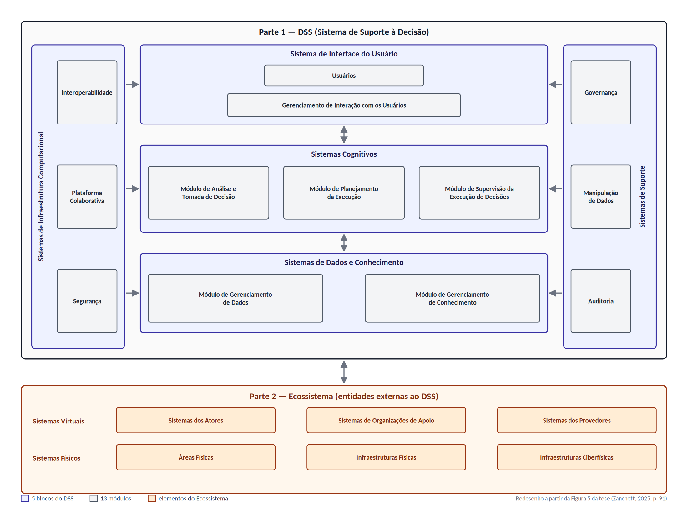

# RADIAN, estudo da arquitetura de referência

Documento de estudo da Fase 2 (aulas 09-10) do Projeto Integrador II. O objetivo aqui é entender a estrutura da RADIAN a partir da tese original, para depois posicionar o nosso sistema (ver [especificação completa](especificacao-completa.md)) dentro dela.

Índice:

- [O que é a RADIAN](#o-que-é-a-radian)
- [Estrutura da RADIAN](#estrutura-da-radian)
  - [Visão detalhada: 2 partes, 5 blocos, 13 módulos](#visão-detalhada-2-partes-5-blocos-13-módulos)
  - [Visão geral: os 7 módulos gerais e as macro funcionalidades](#visão-geral-os-7-módulos-gerais-e-as-macro-funcionalidades)
  - [Os "3 componentes"](#os-3-componentes)
  - [Contagem das funcionalidades](#contagem-das-funcionalidades)
- [Divergência numérica com o Plano de Ensino](#divergência-numérica-com-o-plano-de-ensino)
- [Processo de derivação: genérico, parcial, específico](#processo-de-derivação-genérico-parcial-específico)
- [Rastreabilidade: requisitos do projeto x RADIAN](#rastreabilidade-requisitos-do-projeto-x-radian)
- [Referências](#referências)

## O que é a RADIAN

RADIAN (*Reference Architecture for DecisIon support system for NAtural disaster*) é a arquitetura de referência proposta na tese de doutorado do prof. Pedro Sidnei Zanchett (UFSC, Programa de Pós-Graduação em Engenharia de Automação e Sistemas, defendida em 13/11/2025, orientador prof. Ricardo José Rabelo). A tese está disponível no repositório institucional da UFSC: <https://repositorio.ufsc.br/handle/123456789/271363>.

A ideia central: existem muitos sistemas de suporte à decisão (DSS) para desastres naturais, mas cada um cobre um pedaço isolado do problema (um tipo de desastre, uma fase, um órgão). A RADIAN é um *blueprint* genérico, agnóstico de tecnologia, que descreve quais módulos e funcionalidades um DSS para desastres naturais pode ter e como eles se relacionam. A partir dela deriva-se um DSS específico escolhendo o tipo de desastre, os módulos e as funcionalidades que fazem sentido para o caso.

Foi validada com dois protótipos derivados (um climatológico e um hidrológico) avaliados por especialistas de Defesa Civil, empresas e universidades. O nosso sistema para Presidente Getúlio é, na prática, mais uma derivação da RADIAN: um DSS de tipo hidrológico, subtipo enxurrada/enchente, com escopo bem reduzido.

## Estrutura da RADIAN

A tese descreve a RADIAN em dois níveis de detalhe, e isso importa porque os números citados no Plano de Ensino (3 componentes, 7 módulos, 39 funcionalidades) não são os mesmos da versão final documentada na Seção 6 da tese (2 partes, 5 blocos, 13 módulos, 42 macro funcionalidades). Abaixo apresentamos os dois níveis e, em seguida, explicamos a divergência.

### Visão detalhada: 2 partes, 5 blocos, 13 módulos

É a versão final, apresentada na Seção 6 da tese (Figura 5 "RADIAN – Visão Geral", p. 91, e Figura 6 "RADIAN – Visão Detalhada", p. 93). O texto é explícito: "o processo de construção do RADIAN resultou dela ser composta/estruturada em 2 partes, 5 blocos, 13 módulos e 42 macro funcionalidades" (Seção 5.2, p. 87).

As duas partes:

1. **DSS**, o sistema de suporte à decisão em si. É o "componente central que processa e gerencia informações direcionadas ao enfrentamento de um desastre natural" (p. 92). O usuário é considerado elemento interno ao DSS.
2. **Ecossistema**, os sistemas e entidades externas com os quais o DSS se comunica: fontes de dados e alvos de ações. Dividido em *Sistemas Virtuais* (sistemas dos atores, sistemas de organizações de apoio, sistemas de provedores) e *Sistemas Físicos* (áreas físicas, infraestruturas físicas, infraestruturas ciberfísicas).

Os 5 blocos do DSS e seus 13 módulos:

| Bloco | Módulos | Papel |
|---|---|---|
| Sistema de Interface do Usuário | Usuários; Gerenciamento de Interação com os Usuários | Gerencia as interações entre o DSS e seus usuários em diferentes dispositivos e tecnologias |
| Sistemas Cognitivos | Módulo de Análise e Tomada de Decisão; Módulo de Planejamento da Execução; Módulo de Supervisão da Execução de Decisões | O "coração" do DSS: análise de dados e tomada de decisão colaborativa em malha fechada (decidir, planejar, supervisionar, realimentar) |
| Sistemas de Dados e Conhecimento | Módulo de Gerenciamento de Dados; Módulo de Gerenciamento de Conhecimento | Repositório central de dados e conhecimento que alimenta os demais módulos |
| Sistemas de Suporte | Governança; Manipulação de Dados; Auditoria | Ferramentas transversais de conformidade, governança e rastreabilidade |
| Sistemas de Infraestrutura Computacional | Segurança; Plataforma Colaborativa; Interoperabilidade | Infraestrutura subjacente: segurança, colaboração e comunicação com sistemas externos |

Os blocos de Suporte e de Infraestrutura Computacional são desenhados como colunas laterais na figura original porque apoiam todos os outros blocos e também a troca de dados com o Ecossistema (p. 92).

A estrutura em 5 blocos foi inspirada na arquitetura de referência ISO 23247 de Gêmeos Digitais (interface, coleta de dados, modelo de dados, raciocínio, suporte) e o projeto geral "se baseou parcialmente no consolidado Modelo 3 Camadas" (apresentação, aplicação/lógica, dados) (Seção 5.2, pp. 85-86).

### Visão geral: os 7 módulos gerais e as macro funcionalidades

Antes de chegar à estrutura de 13 módulos, a tese descreve um agrupamento mais alto, em 7 módulos gerais. Ele aparece em três lugares:

- No processo de harmonização das 15 categorias funcionais que deram origem aos módulos (Seção 5.2, pp. 83-84), onde exatamente sete nomes de módulo são citados como destino das categorias.
- No questionário de validação com especialistas: as perguntas P2 a P9 avaliam, um a um, os sete módulos (Seção 7.3, pp. 120-121), e a Questão 23 fala literalmente em "sete módulos gerais, funcionalidades e suas inter-relações" (pp. 123 e 214; respostas no Apêndice C, p. 230).
- Na formalização da RADIAN pela norma ISO/IEC/IEEE 42010 (Apêndice A, pp. 164-166 e 170-172), que lista os módulos e funcionalidades dentro de três partes.

A Seção 5.2 explica a passagem de um nível ao outro: as categorias iniciais foram refinadas "passando de 15 para 13 categorias. Estas 13 categorias foram tidas como os módulos-base da RA" e "os 13 módulos foram enquadrados em 5 blocos principais" (p. 85). Ou seja, os 7 módulos gerais são o agrupamento funcional; os 13 módulos são o desdobramento estrutural desse agrupamento. A tabela abaixo relaciona os dois e lista, para cada módulo geral, as macro funcionalidades documentadas na Seção 6.2 da tese (pp. 94-104). Os nomes das funcionalidades são os da Seção 6.2; entre parênteses vai o nome usado no Apêndice A quando difere.

#### Módulo de Interação com Usuários

Corresponde ao bloco **Sistema de Interface do Usuário** (módulos Usuários e Gerenciamento de Interação com os Usuários). Gerencia a apresentação em diferentes dispositivos (desktop, web, móvel), personalização, acessibilidade e permissões de acesso conforme o modelo de governança (p. 95). Os usuários previstos são representantes da Defesa Civil, representantes dos atores e responsáveis por infraestruturas, e usuários em treinamento.

Macro funcionalidades (p. 95):

1. Gestão de Interação com os Usuários
2. Modo Treinamento & Capacitação

#### Módulo de Comunicação com Sistemas Externos

Corresponde ao bloco **Sistemas de Infraestrutura Computacional** (módulos Interoperabilidade, Plataforma Colaborativa e Segurança). É o módulo que "gerencia a recepção e tratamento de dados de sistemas envolvidos com desastres naturais" (p. 83) e possibilita interoperabilidade e troca de dados com o Ecossistema. Na visão de 7 módulos, a parte de segurança ficava sob o Módulo de Suporte Geral; na visão de 13 módulos, Segurança e Plataforma Colaborativa foram para o bloco de Infraestrutura.

Macro funcionalidades (pp. 102-103):

1. Coleta, Ingestão e Processamento Estatístico de Dados (Apêndice A: "Coleta, Ingestão e Tratamento Estatístico de Dados")
2. Comunicação com Sistemas Ciberfísicos e Infraestruturas
3. Atuação sobre Sistemas Físicos
4. Segurança Computacional
5. Plataforma Colaborativa

#### Módulo de Gestão de Dados

Corresponde ao bloco **Sistemas de Dados e Conhecimento** (módulos Gerenciamento de Dados e Gerenciamento de Conhecimento). É o "repositório central de informações e conhecimento necessários para a operação do DSS" (p. 100), incluindo histórico, lições aprendidas e melhores práticas.

Macro funcionalidades (p. 100):

1. Acesso e Gerenciamento de Dados
2. Acesso e Gerenciamento de Conhecimento

#### Módulo de Suporte Geral

Corresponde ao bloco **Sistemas de Suporte** (módulos Governança, Manipulação de Dados e Auditoria). Responsável por "segurança computacional, configuração do modelo de governança e controle de acesso a dados" (p. 84), relatórios e auditoria.

Macro funcionalidades (p. 101):

1. Governança
2. Geração de Relatórios de Gestão, Operação e Auditoria
3. Manipulação de Dados e Machine Learning
4. LGPD e Privacidade de Dados

#### Módulo de Análise e Tomada de Decisões

Corresponde ao **Módulo de Análise e Tomada de Decisão** do bloco Sistemas Cognitivos. Centraliza a análise do desastre de forma colaborativa e multicritério: estrutura cenários, avalia riscos, faz simulações em tempo real e pode usar IA e assistentes digitais (p. 95). É o módulo mais denso da RADIAN.

Macro funcionalidades (pp. 96-97):

1. Diagnóstico
2. Suporte à Decisão Multicritério
3. Assistente Digital (Apêndice A: "Chatbot")
4. FAQ (Perguntas Frequentes) (Apêndice A: "Perguntas e Pesquisas")
5. Visualização de Dados e Painéis de Decisão
6. Big Data
7. Gêmeo Digital
8. Predição de Cenários
9. Avaliação e Mapeamento de Vulnerabilidades
10. Geração e Simulação de Cenários de Decisão
11. Solução de Problemas (Internos) (Apêndice A: "Problem Solvers (internos)")
12. Análise e Decisão de Alternativas
13. Discussão Colaborativa Distribuída

#### Módulo de Planejamento de Execução

Corresponde ao **Módulo de Planejamento da Execução** do bloco Sistemas Cognitivos. Depois da decisão tomada, apoia o planejamento operacional detalhado: seleção de atores, gestão de recursos, replanejamento em caso de desvio (p. 97).

Macro funcionalidades (pp. 97-99):

1. Planejamento de Ações
2. Seleção de Parceiros
3. Análise de Desempenho de Parceiros e Ações
4. Gerenciamento de Projetos
5. Gerenciamento de Abrigos & Ajuda Humanitária
6. Gerenciamento de Inventário
7. Gerenciamento de Doações
8. Gerenciamento de Resgates e Hospitais
9. Gestão de Recursos Nacionais/Regionais
10. Gerenciamento de Resposta e Restauração
11. Gerenciamento de Recuperação
12. Gerenciamento de Prevenção e Mitigação
13. Gerenciamento de Contingência

#### Módulo de Supervisão de Execução das Decisões

Corresponde ao **Módulo de Supervisão da Execução de Decisões** do bloco Sistemas Cognitivos. "Monitora a execução das ações, envia alertas e permite intervenções em infraestruturas físicas e ciberfísicas" (p. 99). É aqui que a RADIAN posiciona o envio de alertas à comunidade.

Macro funcionalidades (pp. 99-100):

1. Geração e Envio de Alertas
2. Comunicação entre Atores
3. Supervisão e Monitoramento das Ações
4. Gestão e Coordenação de Ações

#### Ecossistema

O Ecossistema não é um dos 7 módulos, mas a Seção 6.2.1.3 (pp. 103-104) também lista macro funcionalidades para ele. Para o nosso projeto, o item relevante é "Sistemas dos Atores Externos", que inclui institutos meteorológicos e hidrológicos e as infraestruturas físicas que coletam dados (sensores, estações).

1. Atores Externos
2. Sistemas dos Atores Externos
3. Problem Solvers (externos)
4. Sistemas gerais externos (Internet, WWW, IA generativa, sistemas de governo, redes sociais)

### Os "3 componentes"

A tese não usa a expressão "3 componentes" para a RADIAN no corpo principal. O que encontramos:

- A **Seção 6** afirma que a RADIAN "é fundamentalmente estruturada em duas partes principais: o DSS e o Ecossistema" (p. 91).
- O **Apêndice A** (formalização pela ISO/IEC/IEEE 42010), no *Functional Viewpoint*, diz que os requisitos funcionais estão "organizados em três partes principais: interação com usuários, comunicação com sistemas externos e cognição" (p. 170). O *Usage Viewpoint* (pp. 164-166) usa a mesma divisão e distribui os 7 módulos gerais dentro dela:

| Parte (Apêndice A) | Módulos gerais |
|---|---|
| 1. Interação com Usuários | Módulo de Interação com Usuários (com o Modo Treinamento & Capacitação) |
| 2. Comunicação com Sistemas Externos | Módulo de Comunicação com Sistemas Externos; Módulo de Gestão de Dados; Módulo de Suporte Geral |
| 3. Cognição | Módulo de Análise e Tomada de Decisões; Módulo de Planejamento de Execução; Módulo de Supervisão de Execução das Decisões |

Essa divisão em três partes com sete módulos é a que melhor explica os números "3 componentes, 7 módulos" do Plano de Ensino. Há uma pequena inconsistência interna no Apêndice: no *Usage Viewpoint* os módulos de Gestão de Dados e de Suporte Geral ficam na Parte 2, e no *Functional Viewpoint* (pp. 171-172) ficam na Parte 3. Isso não muda a contagem de 7.

Há ainda uma segunda leitura possível, também com "3": a Seção 5.2 diz que o projeto da RADIAN "se baseou parcialmente no consolidado Modelo 3 Camadas" (apresentação, aplicação/lógica, dados) (p. 86). Não há uma frase que ligue esse modelo de 3 camadas ao termo "componentes". Por isso registramos as duas hipóteses e vamos confirmar com o professor qual ele tem em mente (ver [Divergência numérica](#divergência-numérica-com-o-plano-de-ensino)).

Há uma terceira menção a "três componentes" na tese (p. 46, revisão de literatura sobre DSS em geral, citando Bonczek e Holsapple: sistema de linguagem, sistema de conhecimento e sistema de processamento de problemas), mas essa é a estrutura clássica de qualquer DSS na literatura, não uma descrição da RADIAN.

### Contagem das funcionalidades

Contamos item por item as macro funcionalidades marcadas na Seção 6.2 da tese (pp. 94-104):

| Módulo (visão de 13) | Itens |
|---|---|
| Sistema de Interface do Usuário | 2 |
| Módulo de Análise e Tomada de Decisão | 13 |
| Módulo de Planejamento da Execução | 13 |
| Módulo de Supervisão da Execução de Decisões | 4 |
| Sistemas de Dados e Conhecimento | 2 |
| Sistemas de Suporte | 4 |
| Sistemas de Infraestrutura Computacional | 5 |
| **Total no DSS** | **43** |
| Ecossistema | 4 |

A tese fala em 42 macro funcionalidades (pp. 85, 87, 92, 107). A diferença de um item provavelmente é o "Modo Treinamento & Capacitação", que em outras partes da tese é tratado como um modo de operação (o "Modo de Treinamento" desenhado como linha pontilhada na Figura 6) e não como funcionalidade. Excluindo esse item, a contagem fecha em 42. Já o número 39 do Plano de Ensino não aparece em nenhum trecho da tese, e a listagem dos 7 módulos no Apêndice A (pp. 164-166), que seria a candidata natural, tem 44 itens (ou 42 se agrupamos os três subitens de treinamento em um só). Não conseguimos reproduzir o 39 a partir do texto.

## Divergência numérica com o Plano de Ensino

Resumo do que o Plano de Ensino (item 09-10 do cronograma) diz e do que a tese documenta:

| Elemento | Plano de Ensino 75PIN 2026/2 | Tese (Seção 5.2, p. 87 e Seção 6) | Onde a tese usa o número do Plano |
|---|---|---|---|
| Partes / componentes | 3 componentes | 2 partes (DSS e Ecossistema) | 3 partes no Apêndice A (Interação com Usuários, Comunicação com Sistemas Externos, Cognição), p. 170; ou o Modelo 3 Camadas, p. 86 |
| Módulos | 7 módulos | 13 módulos em 5 blocos | 7 módulos gerais na harmonização (pp. 83-84), no questionário de validação (pp. 120-123) e no Apêndice A (pp. 164-166) |
| Funcionalidades | 39 funcionalidades | 42 macro funcionalidades (43 itens listados) | Nenhum trecho da tese cita 39 |

Nossa leitura: o Plano de Ensino descreve a visão agregada da RADIAN (a mesma usada nos slides de aula e no questionário de validação), enquanto a Seção 6 da tese descreve a versão final, mais granular. As duas são consistentes entre si em conteúdo (os mesmos módulos, só agrupados de forma diferente); a única contagem que não conseguimos reproduzir é a de 39 funcionalidades.

Pontos a confirmar com o professor na validação de escopo (aulas 15-16):

1. Se "3 componentes" se refere às três partes do Apêndice A ou ao Modelo 3 Camadas.
2. De onde vem a contagem de 39 funcionalidades (uma versão anterior da RADIAN? uma contagem que exclui funcionalidades de Ecossistema e de treinamento?).
3. Qual das duas visões (7 módulos gerais ou 13 módulos em 5 blocos) devemos usar como referência na especificação do nosso sistema. Neste documento usamos os 7 módulos gerais como âncora de rastreabilidade porque são os nomes usados em aula, e indicamos o módulo detalhado correspondente em cada caso.

## Processo de derivação: genérico, parcial, específico

Descrito na Seção 6.3 da tese (pp. 105-112). O processo segue a metodologia ISO GERAM (Generalized Enterprise Reference Architecture and Methodology) e é representado como um "cubo" cujas faces são os tipos de desastre e os grupos funcionais. São três etapas de derivação e uma de instanciação:

1. **Arquitetura Genérica** (Figura 7, "Modelo Genérico de base da RADIAN", p. 106). É a RADIAN completa e abstrata: todas as seis categorias de desastre natural (geológico, hidrológico, meteorológico, climatológico, biológico, tecnológico) e todos os blocos e módulos. Independente de tecnologia, estilo arquitetural e fornecedores.
2. **Arquitetura Parcial** (Figura 8, p. 107). Primeiro passo de derivação. Escolhe-se o(s) tipo(s) de desastre (por exemplo, hidrológico e meteorológico), os módulos da RADIAN que farão parte do DSS, a categoria geral de atores, o modelo de governança e o tipo de fontes de dados. A tese observa que alguns elementos acabam sendo obrigatórios na prática: o Sistema de Interface do Usuário, o Módulo de Análise e Decisão e pelo menos um dos dois módulos de Dados e Conhecimento (p. 106).
3. **Arquitetura Específica** (Figura 9, p. 109). Segundo passo de derivação. Escolhe-se o(s) subtipo(s) de desastre (por exemplo, inundação e alagamento dentro de hidrológico) e as macro funcionalidades concretas dentro dos módulos escolhidos, os atores específicos (bombeiros, polícia, fornecedores de água), o modelo de governança específico, os protocolos de operação e as fontes de dados disponíveis. O resultado é "uma especificação geral, mas concreta, do software" (p. 108).
4. **Instanciação do DSS** (Seção 6.3.2, pp. 110-112). Desenvolvimento do sistema em si: arquitetura de software, linguagens, protocolos de comunicação, integração com sistemas legados, plataformas colaborativas, implantação. A tese destaca que uma mesma funcionalidade pode ser concretizada por mais de um software e que a incorporação de módulos pode ser gradual.

Aplicado ao nosso caso:

| Etapa | Nossa derivação |
|---|---|
| Genérica | RADIAN completa (referência) |
| Parcial | Tipo hidrológico. Módulos: Interação com Usuários, Comunicação com Sistemas Externos, Gestão de Dados, Análise e Tomada de Decisões, Supervisão de Execução das Decisões (parte de alertas) e Suporte Geral (parte de governança/auditoria). Atores: comunidade, Defesa Civil municipal, equipe do projeto. Fontes: órgãos públicos de monitoramento hidrometeorológico |
| Específica | Subtipos enxurrada e enchente nos rios Hercílio e dos Índios, Presidente Getúlio (SC). Funcionalidades selecionadas: ver [rastreabilidade](#rastreabilidade-requisitos-do-projeto-x-radian). Fontes concretas: Defesa Civil SC, ANA HidroWebService (estação 83360000), CEMADEN, INMET, EPAGRI/CIRAM, Open-Meteo |
| Instanciação | Fase 3 da disciplina (implementação) |

## Rastreabilidade: requisitos do projeto x RADIAN

Cada grupo de requisitos funcionais da [especificação completa](especificacao-completa.md) mapeado para o módulo geral da RADIAN e para as macro funcionalidades mais próximas (nomes da Seção 6.2 da tese).

| Grupo de RF (especificação) | Módulo geral da RADIAN | Módulo/bloco detalhado (Seção 6) | Macro funcionalidades mais próximas |
|---|---|---|---|
| [Coleta e integração de dados](especificacao-completa.md#61-coleta-e-integração-de-dados) | [Comunicação com Sistemas Externos](#módulo-de-comunicação-com-sistemas-externos) | Sistemas de Infraestrutura Computacional (Interoperabilidade); Ecossistema (Sistemas dos Atores Externos) | Coleta, Ingestão e Processamento Estatístico de Dados; Comunicação com Sistemas Ciberfísicos e Infraestruturas. O armazenamento do histórico cai em [Gestão de Dados](#módulo-de-gestão-de-dados): Acesso e Gerenciamento de Dados |
| [Análise e previsão](especificacao-completa.md#62-análise-e-previsão) | [Análise e Tomada de Decisões](#módulo-de-análise-e-tomada-de-decisões) | Sistemas Cognitivos / Módulo de Análise e Tomada de Decisão | Diagnóstico; Predição de Cenários; Avaliação e Mapeamento de Vulnerabilidades. O uso de IA sobre dados não estruturados aproxima-se de Manipulação de Dados e Machine Learning ([Suporte Geral](#módulo-de-suporte-geral)) |
| [Painel e visualização](especificacao-completa.md#63-painel-e-visualização) | [Análise e Tomada de Decisões](#módulo-de-análise-e-tomada-de-decisões) | Sistemas Cognitivos / Módulo de Análise e Tomada de Decisão; Sistemas de Suporte (Auditoria) | Visualização de Dados e Painéis de Decisão; Geração e Simulação de Cenários de Decisão (simulação de chuva). O relatório exportável corresponde a Geração de Relatórios de Gestão, Operação e Auditoria |
| [Alerta e notificação](especificacao-completa.md#65-alerta-e-notificação) | [Supervisão de Execução das Decisões](#módulo-de-supervisão-de-execução-das-decisões) | Sistemas Cognitivos / Módulo de Supervisão da Execução de Decisões | Geração e Envio de Alertas; Comunicação entre Atores |
| [Divulgação e portal público](especificacao-completa.md#63-painel-e-visualização) | [Interação com Usuários](#módulo-de-interação-com-usuários) | Sistema de Interface do Usuário | Gestão de Interação com os Usuários. O portal público também se relaciona ao item "Sistemas gerais externos" do Ecossistema (Internet, redes sociais) como canal de disseminação |
| [Registro participativo de ocorrências](especificacao-completa.md#64-registro-participativo-de-ocorrências) | [Gestão de Dados](#módulo-de-gestão-de-dados) | Sistemas de Dados e Conhecimento | Acesso e Gerenciamento de Dados; Avaliação e Mapeamento de Vulnerabilidades ([Análise e Tomada de Decisões](#módulo-de-análise-e-tomada-de-decisões)) |
| [Administração e governança](especificacao-completa.md#66-administração-governança-e-auditoria) | [Suporte Geral](#módulo-de-suporte-geral) | Sistemas de Suporte (Governança, Auditoria); Sistemas de Infraestrutura Computacional (Segurança) | Governança (ajuste de limiares por ponto de medição é uma regra de negócio configurável); Geração de Relatórios de Gestão, Operação e Auditoria (log de coletas e falhas); Segurança Computacional (funções autenticadas) |

O que fica de fora, por escopo: todo o Módulo de Planejamento de Execução (abrigos, doações, resgates, recursos), Discussão Colaborativa Distribuída, Gêmeo Digital, Big Data, Modo Treinamento e Atuação sobre Sistemas Físicos. São funcionalidades de um DSS operado pela Defesa Civil em resposta e recuperação; o nosso sistema cobre monitoramento, classificação de risco e alerta, que é a fase de prevenção/preparação. A tese prevê exatamente esse tipo de corte na etapa de arquitetura específica.

## Referências

- ZANCHETT, Pedro Sidnei. *RADIAN - Uma proposta de Arquitetura de Referência de Sistemas de Suporte à Decisão para Gerenciamento de Desastres Naturais*. Tese (Doutorado em Engenharia de Automação e Sistemas) - Universidade Federal de Santa Catarina, Florianópolis, 2025. Disponível em: <https://repositorio.ufsc.br/handle/123456789/271363>.
- ZANCHETT, Pedro Sidnei. *Apresentação da RADIAN*. Material de aula, 75PIN - Projeto Integrador II, UDESC/CEAVI, 2026/2. Slides 9 ("RADIAN - Visão Geral") e 10 ("RADIAN - Visão Detalhada").
- UDESC/CEAVI. *Plano de Ensino 75PIN - Projeto Integrador II*, 2026/2.

As páginas citadas neste documento são as da numeração impressa da tese.
